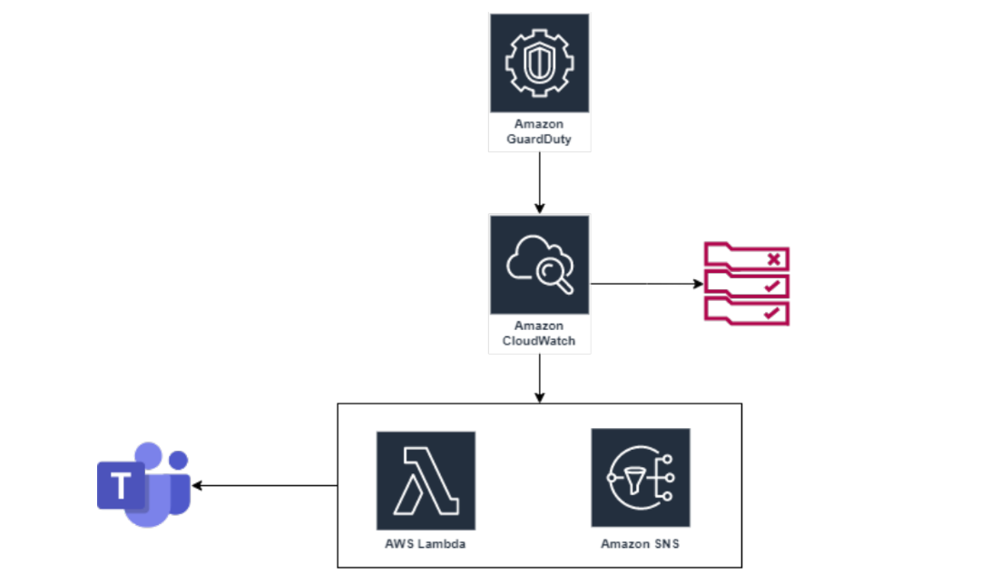

# AWS GuardDuty to Microsoft Teams



> Deliver GuardDuty findings notifications to miscrosoft team. AWS GuardDuty is a managed threat detection service that monitors malicious or
unauthorized behaviors/activities related to AWS resources. Effectively it can be set up to act similarly to an IDS, providing a stream of findings that can
clue security analysts in on potential threats.
Exclusively reviewing these events through the AWS Console somewhat defeats their purpose. By the time you've logged in and seen that six-hour-old
high severity finding, the threat has already had enough time to cause its intended damage.
One reasonable solution is to forward those events to a more visible channel , such as Microsoft Teams. To limit the amount of noise received via this
channel we will only ingest `Medium, High and Critical` Findings.

- Check out [Severity levels for GuardDuty findings](https://docs.aws.amazon.com/guardduty/latest/ug/guardduty_findings.html#guardduty_findings-severity) to help you determine which `Severity Level` you would like to be ping'd about. 

## AWS CloudWatch

> `AWS CloudWatch` helpfully provides us with a GuardDuty Finding event type for rules. Using this, we can easily have CloudWatch trigger a Lambda
function for processing each finding.

### Cloudwatch Events Rule:
``` JSON 
{
  "source": ["aws.guardduty"],
  "detail-type": ["GuardDuty Finding"],
  "detail": {
    "severity": [4, 4.0, 4.1, 4.2, 4.3, 4.4, 4.5, 4.6, 4.7, 4.8, 4.9, 5, 5.0, 5.1, 5.2, 5.3, 5.4, 5.5, 5.6,
  5.7, 5.8, 5.9, 6, 6.0, 6.1, 6.2, 6.3, 6.4, 6.5, 6.6, 6.7, 6.8, 6.9, 7, 7.0, 7.1, 7.2, 7.3, 7.4, 7.5, 7.6, 7.7,
  7.8, 7.9, 8, 8.0, 8.1, 8.2, 8.3, 8.4, 8.5, 8.6, 8.7, 8.8, 8.9, 9.0, 9.1, 9.2, 9.3, 9.4, 9.5, 9.6, 9.7, 9.8, 9.9, 10.0]
  }
}
```
#### All Severity Findings Events Rule (Optional)
```json
{
  "source": [
    "aws.guardduty"
  ],
  "detail-type": [
    "GuardDuty Finding"
  ]
}
```

## AWS Lambda Function

> Next, create the `AWS Lambda` function using any of the available languages. For our use I'm going to use the `Python 3.9` runtime because Python is
perfect for these sorts of small stand-alone functions.

### Lambda Function:
```  PYTHON 
import os
import json
import urllib3

# Get the MS-TEAMs environment variable
teams_webhook_url = os.environ['HookUrl']

# Account List
your_accounts = ''' {
    "accounts": [{
        "name": "ACCOUNT_NAME",
        "id": "123456789012"
    }
    ]
}
'''
account_data = json.loads(your_accounts)
def lambda_handler(event, context):
    # Extract the finding from the event data
    if isinstance(event['detail'], str):
        finding = json.loads(event['detail'])

    else:
        finding = event['detail']
    print(finding)
    severity = finding['severity']

    # Only send alerts for Medium and greater severity events
    if severity >= 4.0:
        # Extract the required fields
        account_id = finding['accountId']
        for account in account_data['accounts']:
            if account['id'] == account_id:
                account_id = account['id'], account['name']

        # Get the region
        region = event['region']

        title = (
        f"AWS GuardDuty Finding in {account_id}"
        )

        # Define the message to be sent to MS-Teams
        message = {
                "@context": "https://schema.org/extensions",
                "@type": "MessageCard",
                "themeColor": "85dbe1",
                "title": title,
                "text": f"{finding['description']}",
                "sections": [
                    {
                        "facts": [
                            {
                                "name": "Type: ",
                                "value": f"{finding['type']}"
                            },
                            {
                                "name": "Severity: ",
                                "value": f"{severity}"
                            },
                            {
                                "name": "Region: ",
                                "value": f"{region}"
                            }
                        ]
                    }
                ]
            }
        # Convert message to JSON string
        message_json = json.dumps(message)

        # Send the message to MS-Teams using urllib3
        http = urllib3.PoolManager()
        try:
            response = http.request('POST', teams_webhook_url, body=message_json.encode('utf-8'),
                                    headers={'Content-Type': 'application/json'})
            if response.status != 200:
                raise Exception(f"Failed to send message to Microsoft Teams: {response.status}")
        except Exception as e:
            # Handle exception here
            print(f"Failed to send message to MS-Teams: {e}")
    return 'Success'
```

## Microsoft Teams Webhook
To add an Incoming Webhook to a Teams channel, follow the steps oulined in the below link. Once the Webhook has been created, set it as an
environment variable in the lambda function key = HookUrl and value = Genertated hookurl.

- LINK: [Webhook SetUp](https://learn.microsoft.com/en-us/microsoftteams/platform/webhooks-and-connectors/how-to/add-incoming-webhook?tabs=dotnet#create-incoming-webhooks-1)


